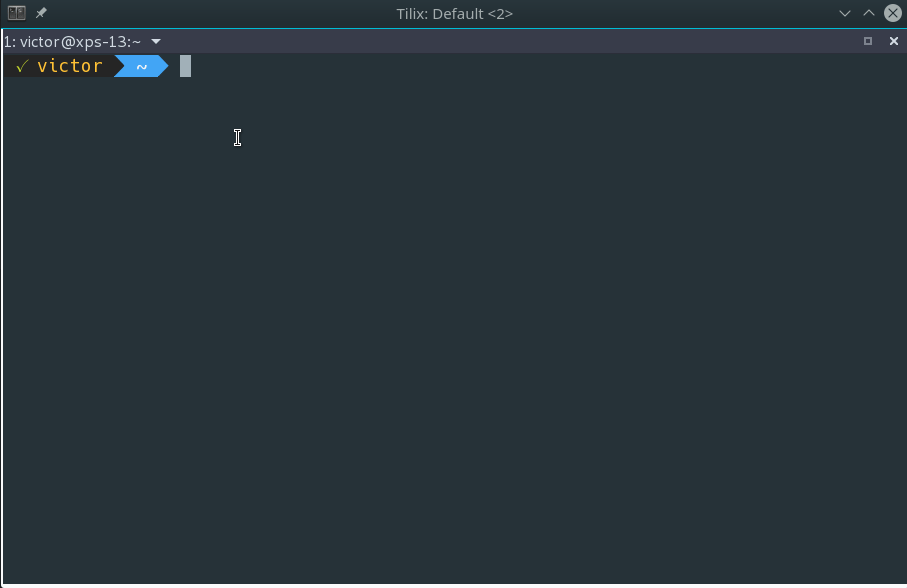
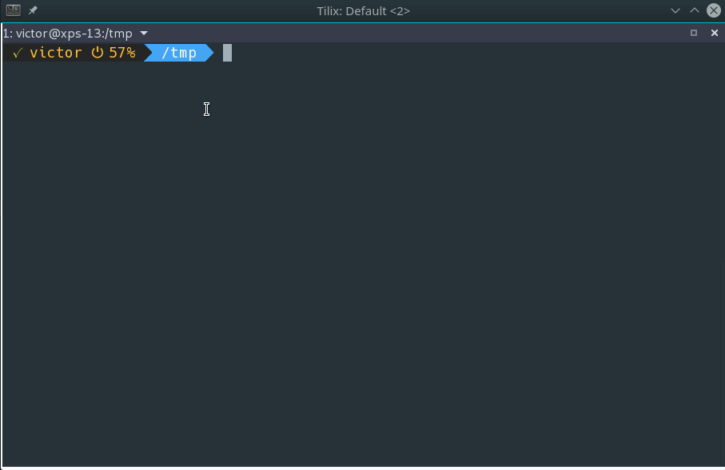

# powerline-simple

A simple powerline prompt for Bash (without python).


The prompt provides the following information:
* Previous exit code
* Username
* Hostname (when connecting via SSH)
* Battery status
* sudo cached credentials
* Current path
* Git status

#### Battery

The battery plugin displays a battery icon and battery percentage when the AC adapter is not present. Both icon and percentage are color coded, and change according to the battery status.


#### sudo

Indicates when sudo credentials are cached.



#### git

When browsing a git folder, the prompt will show a basic color coded git status for uncommitted/modified files (nothing else is shown).



Installation
---

Download `powerline-simple` to your machine (optionally make it hidden) and source it on your `${HOME}/.bashrc`.

```
. ${HOME}/.powerline-simple
```

Requirements
---

You may need to install the powerline fonts to be able to see some of the characters displayed in the prompt. 

#### Ubuntu

```
apt install fonts-powerline
```

Additional Options
---

You can also disable the battery and sudo info display by changing the two values to `n` in powerline-simple.

```
battery_info="y"
sudo_info="y"
```
